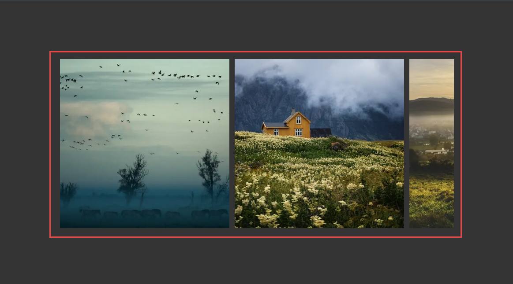

# Slider

Uma demonstração de como criar um carrossel de slides horizontais que permite navegar arrastando o mouse.

<p align="center">
  
</p>

A segui o codigo principal do carrosel:

```javascript
  const handleMouseDown = (event: React.MouseEvent<HTMLDivElement>) => {
    setIsMouseDown(true);
    setInitialDrag(event.clientX);
    setScrollLeft(slider.current?.scrollLeft || 0);
  };

  const handleMouseUp = () => {
    setIsMouseDown(false);
    setCursor("cursor-grab");
  };

  const handleMouseMove = (event: React.MouseEvent<HTMLDivElement>) => {
    event.preventDefault();
    if (isMouseDown && slider.current) {
      setCursor("cursor-grabbing");
      const dx = event.clientX - initialDrag;
      slider.current.scrollLeft = scrollLeft - dx;
    }
  };
```